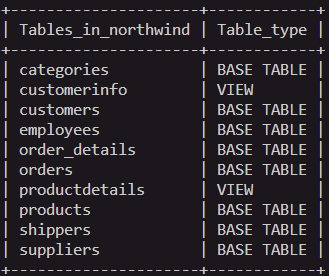

# northwind_api

<<<<<<< HEAD
A api for building REST Web Services in Go. Uses gorilla/mux as a router/dispatcher and CORS as a middleware handler. 

=======
- Clone this repo
>>>>>>> ea3d26791daa6186a6a949a660f38c6ec22302f7

# Install the dependencies with:

- go get github.com/go-sql-driver/mysql
- go get github.com/gorilla/mux
- go get github.com/joho/godotenv

 # API's Implemented:

- GET     /api
- GET     /api/{id} 
- POST    /api
- PUT     /api 
- DELETE  /api/{id}  

# Databae Tables 



# API Reference

### Get  /table name 
   Returns result identity
 #### Response
   <details><summary>Show example response</summary>
   <p>
   ```json
   [
    {
        "ShipperID": 1,
        "CompanyName": "Speedy Express",
        "Phone": "(503) 555-9831"
    },
    {
        "ShipperID": 2,
        "CompanyName": "United Package",
        "Phone": "(503) 555-3199"
    }
    ]
    ````
    </p>
    </details>

### Get  /table name/{id}  
Returns a book by id
#### Response
   <details><summary>Show example response</summary>
   <p>
   ```json
   {
        "ShipperID": 2,
        "CompanyName": "United Package",
        "Phone": "(503) 555-3199"
    }
     ````
    </p>
    </details>

### POST /table name  
Creates a new Column
#### Response
   <details><summary>Show example response</summary>
   <p>
   ```json
   {
        "ShipperID": 3,
        "CompanyName": "G2G",
        "Phone": "(503) 555-3199"
    }
     ````
    </p>
    </details>

### PUT  /table name 
Update existing Coloumn
#### Response
 <details><summary>Show example response</summary>
  <p>
   ```json
   {
        "ShipperID": 3,
        "CompanyName": "G2G",
        "Phone": "0928 620999"
    }
     ````
    </p>
    </details>

### Delete /table name/{id}  

Delete an existing column by ID
#### Response
 <details><summary>Show example response</summary>
  <p>
   ```json
 {
    "result": "success"
}
     ````
    </p>
    </details>

# Project is created with:

- Golang
- gorilla/mux
- joho/godotenv
- MYSQL

### How to run


# To start 
- Create a database in MySQL

- Create a file called .env 

- Configure credentials in .env

- In the database create the tables according to northwind.sql

- Compile with go run .

- Now you can test the API with postman, it will be on localhost:8000


